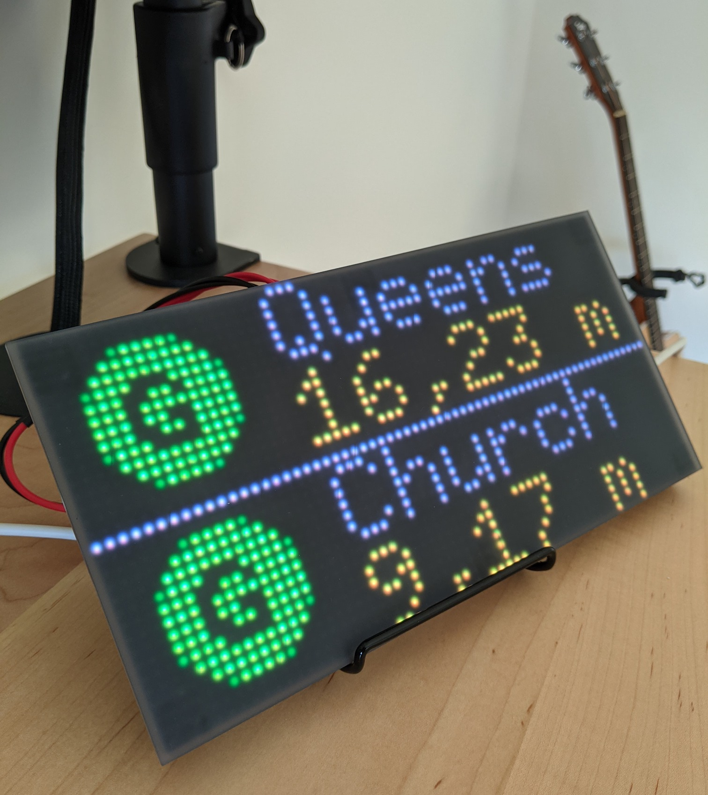

# MTA Portal

Run your own MTA Portal to display trains arrivals using Adafruit's [hardware](https://www.adafruit.com/product/4812) and libraries.

Follow Adafruit main [tutorial](https://learn.adafruit.com/adafruit-matrixportal-m4) to set up your MatrixPortal

## Config

You'll need your own `secrets.py`. Check [here](https://learn.adafruit.com/adafruit-matrixportal-m4/internet-connect) on how to create one.

Config variables:

- `STOP_ID`: Find your station ID [here](https://github.com/jonthornton/MTAPI/blob/master/data/stations.json)
- `UPDATE_DELAY`: Delay in seconds before fetching new data
- `MINIMUM_MINUTES_DISPLAY`: Only display arrival times greater or equal than this value. Useful to only show trains you can catch.
- `BACKGROUND_IMAGE`: Image to use for the background
